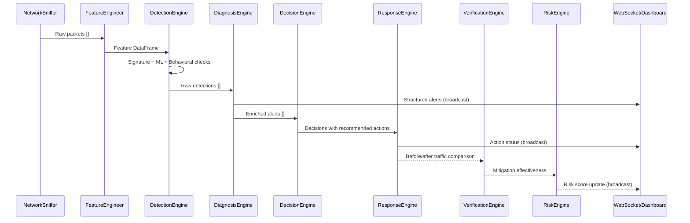

<div align="center">

# 🛡️ NNNIDS
### Neural Network Network Intrusion Detection System
**A self-healing, AI-powered network security platform with real-time threat detection, automated mitigation, and an interactive live dashboard.**

[](https://python.org)
[](https://fastapi.tiangolo.com)
[](https://react.dev)
[](https://vitejs.dev)
[](https://scikit-learn.org)
[](https://docs.docker.com/compose/)
[](LICENSE)

---

## 🚀Deployment link 
👉 [Click here to view the project](https://69d43effeceb5b80b7958b6b--luxury-sawine-0fa1ca.netlify.app/)

</div>

---

## 📋 Table of Contents

- [Overview](#-overview)
- [Key Features](#-key-features)
- [System Architecture](#-system-architecture)
- [Detection Pipeline](#-detection-pipeline)
- [Backend Engines](#-backend-engines)
- [Frontend Dashboard](#-frontend-dashboard)
- [API Reference](#-api-reference)
- [Getting Started](#-getting-started)
- [Configuration](#-configuration)
- [Docker Deployment](#-docker-deployment)
- [Tech Stack](#-tech-stack)
- [Project Structure](#-project-structure)
- [Security Modes](#-security-modes)
- [Contributing](#-contributing)
- [License](#-license)

---

## 🔍 Overview

**NNNIDS** (Neural Network Network Intrusion Detection System) is a full-stack, real-time network security platform that monitors live network traffic, detects intrusions using a **hybrid AI pipeline**, automatically responds to threats, and verifies the effectiveness of its own mitigations — all while streaming results to a sleek live dashboard.

It combines **rule-based signatures**, **machine learning anomaly detection** (Isolation Forest), and **behavioral heuristics** into a unified 7-stage detection pipeline. When a threat is detected, NNNIDS can automatically block offending IPs via the OS firewall, throttle connections, or quarantine hosts — and then verify whether the mitigation was effective.

> **NNNIDS is designed for home/office network monitoring, cybersecurity research, and educational exploration of intrusion detection systems.**

---

## ✨ Key Features

| Feature | Description |
|---|---|
| 🔴 **Live Traffic Capture** | Captures real network packets via Scapy/Npcap (Windows) or raw sockets (Linux) |
| 🤖 **Hybrid AI Detection** | Combines signature rules + Isolation Forest ML + behavioral baselines |
| 🧠 **Threat Intelligence** | Built-in feed with known C2 IPs and malicious CIDR ranges; CDN/cloud whitelist |
| ⚡ **Automated Response** | Blocks IPs via Windows Firewall (`netsh`) or Linux `iptables` |
| ✅ **Self-Healing Verification** | Measures mitigation effectiveness by comparing before/after traffic |
| 📊 **Dynamic Risk Scoring** | 0–100 composite risk score with trend tracking (INCREASING/STABLE/DECREASING) |
| 🔄 **Continuous Monitoring** | Configurable rolling-window monitoring with automatic scan cycles |
| 🌐 **Real-time Dashboard** | WebSocket-powered React dashboard with live alerts, traffic graphs, and risk cards |
| 🐳 **Docker Support** | Full `docker-compose` setup for containerized deployment |
| 🗄️ **Persistent Storage** | SQLite database with full history of alerts, actions, and verifications |

---

## 🏗️ System Architecture

```
┌─────────────────────────────────────────────────────────────────────┐
│                         NNNIDS Platform                              │
│                                                                     │
│   ┌─────────────────────────────────────────────────────────────┐   │
│   │                    React Frontend (Vite)                    │   │
│   │  ┌──────────┐  ┌──────────┐  ┌──────────┐  ┌──────────┐   │   │
│   │  │Dashboard │  │ Alerts   │  │  Risk    │  │ Traffic  │   │   │
│   │  │  Page    │  │  Page    │  │  Card    │  │  Graph   │   │   │
│   │  └────┬─────┘  └────┬─────┘  └────┬─────┘  └────┬─────┘   │   │
│   │       └─────────────┴─────────────┴──────────────┘         │   │
│   │                          WebSocket / REST API               │   │
│   └──────────────────────────────┬──────────────────────────────┘   │
│                                  │                                   │
│   ┌──────────────────────────────▼──────────────────────────────┐   │
│   │                   FastAPI Backend (Python)                   │   │
│   │                                                             │   │
│   │   NetworkSniffer → FeatureEngineer → DetectionEngine        │   │
│   │        │                                  │                 │   │
│   │        │              ┌───────────────────┤                 │   │
│   │        │         ThreatIntel         BehavioralEngine       │   │
│   │        │              └───────────────────┤                 │   │
│   │        ▼                                  ▼                 │   │
│   │   DiagnosisEngine → DecisionEngine → ResponseEngine         │   │
│   │        │                                  │                 │   │
│   │        ▼                                  ▼                 │   │
│   │     Database ◄──── VerificationEngine ◄──RiskEngine         │   │
│   └─────────────────────────────────────────────────────────────┘   │
│                                                                     │
└─────────────────────────────────────────────────────────────────────┘
```

### Component Communication



---

## 🔬 Detection Pipeline

NNNIDS runs all captured traffic through a **7-stage pipeline**:

```
Stage 1: CAPTURE    → Packet sniffing (Scapy/live or replay)
Stage 2: FEATURES   → Per-IP feature extraction (packet rate, SYN ratio, port entropy, etc.)
Stage 3: TRAINING   → Isolation Forest self-trains on first window (unsupervised baseline)
Stage 4: DETECTION  → Signature rules + ML anomaly + behavioral heuristics + threat intel
Stage 5: DIAGNOSIS  → Enrich detections into structured, human-readable alert records
Stage 6: DECISION   → Map each alert to a recommended action (BLOCK / THROTTLE / MONITOR)
Stage 7: RESPONSE   → Execute OS-level firewall commands; log to database
         VERIFY     → Compare before/after traffic features to confirm mitigation worked
         RISK       → Recalculate composite 0–100 risk score; broadcast to dashboard
```

### Detection Layers

| Layer | Method | Detects |
|---|---|---|
| **Layer 1: Signatures** | Rule-based thresholds | Port scans, SYN floods, DDoS, unusual traffic |
| **Layer 2: ML Anomaly** | Isolation Forest (unsupervised) | Unknown threats deviating from baseline |
| **Layer 3: Behavioral** | Per-IP rolling baselines | New devices, traffic spikes, odd-hour activity |
| **Layer 4: Threat Intel** | CIDR/IP lookup table | Known C2 servers, malicious IP ranges |

---

## ⚙️ Backend Engines

### `network_sniffer.py` — Packet Capture
Wraps Scapy for live/interface-specific packet capture. Handles Windows Npcap and Linux raw socket differences. Supports both **live** and **replay** modes.

### `feature_engineering.py` — Feature Extraction
Converts raw packet lists into a per-source-IP `pandas.DataFrame` with features:
- `packet_count`, `packet_rate` (packets/second)
- `byte_count`, `avg_packet_size`
- `syn_count`, `syn_ratio`, `ack_count`
- `unique_dst_ports` (port entropy indicator)
- `protocol_entropy`, `tcp_ratio`, `udp_ratio`

### `detection_engine.py` — Hybrid Threat Detector
```python
class DetectionEngine:
    # 1. Signature rules (lambda conditions over features)
    # 2. Threat intel CIDR lookup
    # 3. Isolation Forest ML (trained on first window)
    # 4. Behavioral heuristics (via BehavioralEngine)
```
Uses **Isolation Forest** (`scikit-learn`) unsupervised anomaly detection. Assigns severity (**CRITICAL / HIGH / MEDIUM**) based on anomaly score.

### `diagnosis_engine.py` — Alert Enrichment
Transforms raw detections into structured, human-readable alerts with:
- Attack taxonomy (name, description, MITRE-style indicators, impact)
- Confidence string (ML score → percentage, signature = 100%)
- Plain-English reason sentence

### `decision_engine.py` — Action Recommender
Maps alert severity and type to recommended actions:

| Severity | Default Action |
|---|---|
| CRITICAL | `BLOCK_IP` |
| HIGH | `BLOCK_IP` |
| MEDIUM | `THROTTLE` |
| LOW | `MONITOR` |

### `response_engine.py` — OS-Level Mitigation
Executes real firewall commands. Cross-platform support:

```
Windows → netsh advfirewall (requires Administrator)
Linux   → iptables INPUT DROP rule (requires root)
```

Both `live` (real changes) and `simulate` (dry-run log only) modes supported.

### `verification_engine.py` — Self-Healing Check
Compares traffic features **before** and **after** each mitigation to measure effectiveness. Produces a `mitigation_effectiveness` score (0.0–1.0) fed back into the risk engine.

### `risk_engine.py` — Dynamic Risk Scoring
Computes composite 0–100 risk score:

```
Risk = alert_risk (0-25)
     + severity_risk (0-40)
     + mitigation_risk (0-20)
     + traffic_risk (0-15)
     [exponentially smoothed with previous score]
```

Trend tracking over last 5 windows → **INCREASING / STABLE / DECREASING**.

### `threat_intel.py` — IP Intelligence
- Whitelist: Google, Cloudflare, Fastly, AWS, Azure, Akamai CIDRs (never flagged)
- Malicious CIDR list + known C2 IP table
- Offline — no external API calls required

### `behavioral_engine.py` — Behavioral Heuristics
Maintains per-IP rolling baselines across scan windows:
- **New device detection**: IP never seen before
- **Baseline spike**: Current rate > 3× rolling average
- **Odd-hour traffic**: Activity outside normal observed hours

---

## 🖥️ Frontend Dashboard

Built with **React 19 + Vite 8 + Recharts + TailwindCSS**.

### Pages

#### Dashboard (`/`)
Real-time monitoring overview:
- **Live Alert Feed** — WebSocket-streamed alerts as they arrive
- **Risk Score Card** — animated 0–100 gauge with trend indicator
- **Traffic Graph** — Recharts line chart of packet rates per IP
- **Attack Timeline** — chronological incident log
- **Action Panel** — real-time mitigation action log

#### Alerts Page (`/alerts`)
Full alert management interface:
- Complete alert history with filtering by severity/type
- Detailed per-alert view with attack taxonomy, indicators, confidence
- Manual IP block/unblock controls
- Export capabilities

### Real-time WebSocket Events

| Event Type | Payload | Description |
|---|---|---|
| `connected` | config info | Initial connection handshake |
| `pipeline` | stage, progress/7 | Pipeline progress updates |
| `alerts` | alerts[], count | New detections broadcast |
| `action` | action record | Mitigation action taken |
| `verifications` | verification[] | Self-healing results |
| `risk` | score, level, trend | Risk score update |
| `monitor_tick` | timestamp | Heartbeat per monitoring cycle |
| `error` | message, action | Error with recovery hint |

---

## 📡 API Reference

Base URL: `http://localhost:8000`

### System

| Method | Endpoint | Description |
|---|---|---|
| `GET` | `/` | System info and version |
| `GET` | `/status` | Current system state + stats |
| `GET` | `/stats` | Database stats + blocked IPs |

### Scanning

| Method | Endpoint | Body | Description |
|---|---|---|---|
| `POST` | `/scan/start` | `{"duration": 10}` | One-shot packet capture scan |
| `POST` | `/scan/reset` | — | Clear stuck scan state |
| `POST` | `/monitor/start` | `{"window_seconds": 10, "interval_seconds": 15}` | Start continuous monitoring |
| `POST` | `/monitor/stop` | — | Stop continuous monitoring |

### Data

| Method | Endpoint | Description |
|---|---|---|
| `GET` | `/alerts?limit=50` | Recent alerts from database |
| `GET` | `/actions?limit=50` | Recent mitigation actions |
| `GET` | `/verifications?limit=50` | Mitigation verification results |
| `GET` | `/risk` | Current risk score + history |
| `GET` | `/traffic` | Latest traffic feature snapshot |
| `GET` | `/history?limit=100` | Full combined history |
| `GET` | `/blocked` | Currently blocked IPs |

### Mitigation

| Method | Endpoint | Body | Description |
|---|---|---|---|
| `POST` | `/block` | `{"ip": "10.0.0.5"}` | Manually block an IP |
| `POST` | `/unblock` | `{"ip": "10.0.0.5"}` | Manually unblock an IP |

### WebSocket

```
ws://localhost:8000/ws
```

Persistent WebSocket connection for real-time event streaming to the dashboard.

---

## 🚀 Getting Started

### Prerequisites

| Requirement | Notes |
|---|---|
| **Python 3.11+** | Backend runtime |
| **Node.js 20+** | Frontend toolchain |
| **Npcap** (Windows) | Required for live packet capture — [npcap.com](https://npcap.com) |
| **Administrator rights** | Required for live firewall blocking |
| **Git** | [git-scm.com](https://git-scm.com) |

### 1. Clone the Repository

```bash
git clone https://github.com/dbijp/NNNIDS.git
cd NNNIDS
```

### 2. Backend Setup

```bash
cd backend

# Create and activate virtual environment
python -m venv venv

# Windows
venv\Scripts\activate

# Linux / macOS
source venv/bin/activate

# Install dependencies
pip install -r requirements.txt
```

### 3. Configure (Optional)

Edit `backend/config.py` or set environment variables:

```bash
# Capture mode: "live" (real packets) or "replay" (test data)
set NNNIDS_CAPTURE_MODE=live

# Response mode: "live" (real firewall) or "simulate" (dry run)
set NNNIDS_RESPONSE_MODE=simulate

# Network interface (auto-detected if not set)
set NNNIDS_INTERFACE=\Device\NPF_{your-interface-guid}

# Monitoring window and interval (seconds)
set NNNIDS_MONITOR_WINDOW=10
set NNNIDS_MONITOR_INTERVAL=15

# Auto-start monitoring on launch
set NNNIDS_AUTO_START=true
```

### 4. Start the Backend

> **Windows**: Run PowerShell **as Administrator** for live firewall blocking.

```bash
# From backend/ directory (with venv activated)
python main.py
```

The API will be available at `http://localhost:8000`.
Interactive API docs: `http://localhost:8000/docs`

### 5. Frontend Setup

```bash
cd frontend
npm install
npm run dev
```

Dashboard will be available at `http://localhost:5173`.

---

## 🐳 Docker Deployment

Run both backend and frontend with a single command:

```bash
docker-compose up --build
```

| Service | URL |
|---|---|
| Frontend | http://localhost:3000 |
| Backend API | http://localhost:8000 |

> ⚠️ **Note**: Live packet capture inside Docker requires host network access and Npcap/libpcap on the host. For containerized demo purposes, set `NNNIDS_CAPTURE_MODE=replay`.

---

## ⚙️ Configuration

All configuration is driven by environment variables with sane defaults:

| Variable | Default | Description |
|---|---|---|
| `NNNIDS_CAPTURE_MODE` | `live` | `live` = real packets, `replay` = test mode |
| `NNNIDS_RESPONSE_MODE` | `live` | `live` = real firewall, `simulate` = dry run |
| `NNNIDS_INTERFACE` | *(auto)* | Specific network adapter GUID/name |
| `NNNIDS_MONITOR_WINDOW` | `10` | Packet capture duration per window (seconds) |
| `NNNIDS_MONITOR_INTERVAL` | `2` | Pause between monitoring windows (seconds) |
| `NNNIDS_AUTO_START` | `true` | Auto-start continuous monitoring on launch |

---

## 🛠️ Tech Stack

### Backend
| Library | Version | Purpose |
|---|---|---|
| **FastAPI** | 0.135 | Async REST API + WebSocket server |
| **Uvicorn** | 0.44 | ASGI server |
| **Scapy** | 2.7 | Live packet capture and analysis |
| **scikit-learn** | 1.8 | Isolation Forest ML anomaly detection |
| **pandas** | 3.0 | Feature engineering DataFrames |
| **NumPy** | 2.4 | Numerical computation |
| **Pydantic** | 2.12 | Request/response validation |
| **SQLite** | built-in | Persistent alert/action storage |

### Frontend
| Library | Version | Purpose |
|---|---|---|
| **React** | 19 | UI framework |
| **Vite** | 8 | Build tool and dev server |
| **React Router** | 7 | Client-side routing |
| **Recharts** | 3.8 | Traffic visualization charts |
| **Axios** | 1.14 | HTTP API client |
| **TailwindCSS** | 4.2 | Utility-first styling |

---

## 📁 Project Structure

```
NNNIDS/
├── backend/
│   ├── main.py                # FastAPI app, pipeline orchestration, WebSocket broadcaster
│   ├── config.py              # Environment-driven configuration
│   ├── network_sniffer.py     # Live packet capture (Scapy)
│   ├── feature_engineering.py # Per-IP traffic feature extraction
│   ├── detection_engine.py    # Hybrid detector (signatures + ML + threat intel)
│   ├── behavioral_engine.py   # Per-IP behavioral baselines and heuristics
│   ├── threat_intel.py        # Offline threat intelligence (C2 IPs, malicious CIDRs, CDN whitelist)
│   ├── diagnosis_engine.py    # Alert enrichment with taxonomy and plain-English reasons
│   ├── decision_engine.py     # Maps alerts to recommended actions
│   ├── response_engine.py     # OS-level firewall mitigation (Windows/Linux)
│   ├── verification_engine.py # Self-healing: measures mitigation effectiveness
│   ├── risk_engine.py         # Dynamic 0–100 composite risk scoring
│   ├── database.py            # SQLite persistence layer
│   └── requirements.txt       # Python dependencies
│
├── frontend/
│   ├── src/
│   │   ├── App.jsx            # Router setup (Dashboard + AlertsPage)
│   │   ├── index.jsx          # React entry point
│   │   ├── index.css          # Global styles and design system
│   │   ├── pages/
│   │   │   ├── Dashboard.jsx  # Main monitoring overview
│   │   │   └── AlertsPage.jsx # Full alert management page
│   │   ├── components/
│   │   │   ├── LiveAlertFeed.jsx   # Real-time WebSocket alert stream
│   │   │   ├── RiskScoreCard.jsx   # Animated risk gauge
│   │   │   ├── TrafficGraph.jsx    # Recharts packet-rate line chart
│   │   │   ├── AttackTimeline.jsx  # Chronological incident timeline
│   │   │   ├── ActionPanel.jsx     # Mitigation action log
│   │   │   ├── AlertsPanel.jsx     # Alert summary panel
│   │   │   └── ExpertPanel.jsx     # Detailed expert analysis view
│   │   └── services/          # API client utilities
│   ├── package.json
│   └── vite.config.js
│
├── Dockerfile.backend         # Backend Docker image
├── Dockerfile.frontend        # Frontend Docker image (nginx)
├── docker-compose.yml         # Multi-service orchestration
├── nginx.conf                 # Nginx config for frontend serving
└── README.md
```

---

## 🔒 Security Modes

### Response Modes

| Mode | Behavior | Use Case |
|---|---|---|
| `simulate` | Logs what would happen, no system changes | Development, testing, demos |
| `live` | Executes real OS firewall commands | Production monitoring (requires admin) |

### Capture Modes

| Mode | Behavior | Use Case |
|---|---|---|
| `live` | Capture real network packets via Scapy | Production network monitoring |
| `replay` | Process pre-recorded packet data | Testing, CI/CD, Docker demos |

> **⚠️ Important**: Running in `live` response mode requires the backend to be started as **Administrator** (Windows) or **root** (Linux). NNNIDS will automatically attempt UAC elevation on Windows if response mode is `live` and the process lacks admin rights.

---

## 🤝 Contributing

Contributions are welcome! Here's how to get started:

1. **Fork** this repository
2. **Create** a feature branch: `git checkout -b feature/amazing-feature`
3. **Commit** your changes: `git commit -m 'feat: add amazing feature'`
4. **Push** to branch: `git push origin feature/amazing-feature`
5. **Open** a Pull Request

### Ideas for Contributions

- [ ] PCAP file replay support for offline analysis
- [ ] Email/webhook alerting integrations (Slack, PagerDuty)
- [ ] Additional ML models (Random Forest, LSTM)
- [ ] MITRE ATT&CK framework mapping for detections
- [ ] IPv6 support
- [ ] Live packet stream visualization
- [ ] Multi-interface monitoring
- [ ] Exportable incident reports (PDF/CSV)

---

## 📄 License

This project is licensed under the **MIT License** — see the [LICENSE](LICENSE) file for details.

---

<div align="center">

**Built with ❤️ for network security research and education.**

*Star ⭐ this repo if you found it useful!*

</div>
